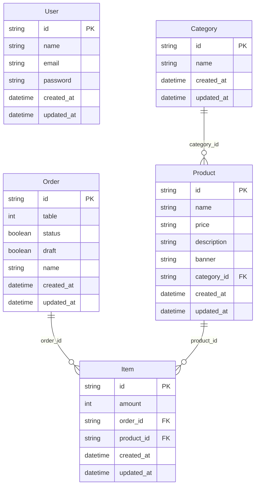

# Banco de dados — Backend Projeto Pizzaria

- **Tecnologia**: PostgreSQL
- **ORM**: Prisma (`@prisma/client` / `prisma`)
- **Schema**: [prisma/schema.prisma](../prisma/schema.prisma)
- **Migrations**: [prisma/migrations/](../prisma/migrations/), aplicadas via `yarn prisma migrate dev`
- **Seeds**: não há arquivo de seed no repositório

## Modelo de dados



`User` não possui relacionamento com as demais tabelas no schema atual — é usado apenas para autenticação/autorização de acesso à API, não para vincular quem criou um pedido ou produto.

## Observações sobre os modelos

- Todos os identificadores são `String` com `@default(uuid())` (mapeados como `TEXT` no PostgreSQL).
- `Product.price` é armazenado como `String`, não como tipo numérico/decimal — `TODO: confirmar` se isso é proposital (ex.: formatação já pronta para exibição) ou uma simplificação a evoluir.
- `Order.draft` (default `true`) e `Order.status` (default `false`) controlam o ciclo de vida do pedido:
  1. `draft: true, status: false` — pedido em edição (mesa ainda adicionando itens).
  2. `draft: false, status: false` — pedido enviado, aguardando finalização (é o filtro usado por `GET /orders`).
  3. `draft: false, status: true` — pedido finalizado.
- Os nomes das tabelas no banco são mapeados via `@@map`: `users`, `categories`, `products`, `orders`, `items`.

## Migrations existentes

| Migration | Conteúdo |
|---|---|
| `20240406104448_create_table_users` | Criação da tabela `users` |
| `20240406111256_create_models_pizzaria` | Criação das tabelas `categories`, `products`, `orders`, `items` e das foreign keys entre elas |

Para aplicar as migrations em um novo ambiente:

```bash
yarn prisma migrate dev
```
